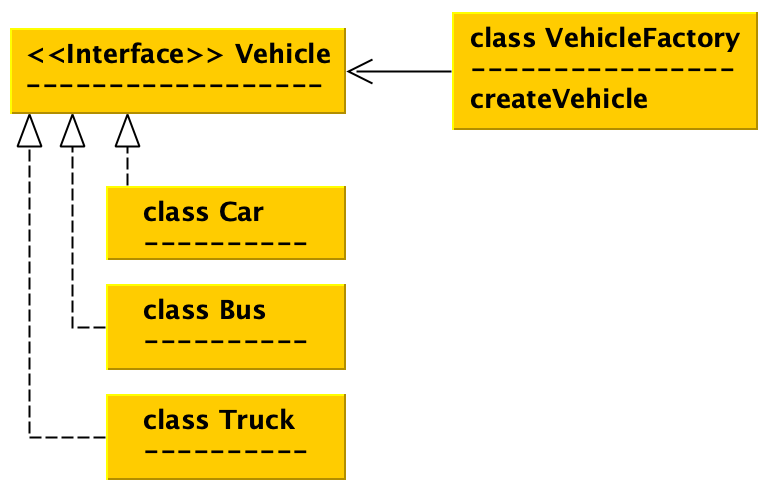

# Comparing JVM language features
This branch is dedicated to compare similarties between selected JVM languages. Their constructions and features. To highlight specific only
command-line is used for compilation and run.


## **A.** Comparing the selection control mechanism, 3 JVM languages
The comparison of selection control mechanism used for change the flow of the program. The comparison is done accross a various JVM languages. Naive vehicle factory (Img.1) is considered.


### **1. Java** - switch statement
```bash
$ java -version 
output: openjdk version "18" 2022-03-2
``` 
Used switch statement for the factory construciton is according to the [JEP-420: Pattern Matching](https://openjdk.java.net/jeps/420). It is required to enable preview features. 

Compile Java Program:
```bash
$ javac --release 18 --enable-preview -g -classpath out -sourcepath java -d out ./java/*java
```
Execute Java Program:
```bash
$ java --enable-preview -cp out VehicleFactory
```

### **2. Kotlin** - when statement
Kotlin language uses `when` statement with ability branch the program flow. The similarity to the Java `switch` statement is noticable. 
```bash
$ kotlin -version
Kotlin version 1.6.10-release-923 (JRE 18+36-2087)
```

Compile Kotlin Program: 
```bash
$ kotlinc ./kotlin/*.kt -include-runtime -d ./out/vehicle_factory.jar
```

Execute Kotlin Program:
```bash
$ kotlin -classpath ./out/vehicle_factory.jar KVehicleFactoryKt
```

### **3. Scala** - match statement
Scala introduces a `match` pattern for controling the program flow branching. There are similarities to the Java `swicht` statement.
```bash
$ scala -version
Scala code runner version 2.13.8 -- Copyright 2002-2021, LAMP/EPFL and Lightbend, Inc.
```

Compile Scala Program:
```bash 
$ scalac -d out ./scala/*.scala 
```

Execute Scala Program
```bash
$ scala -cp out SVehicleFactory
```

